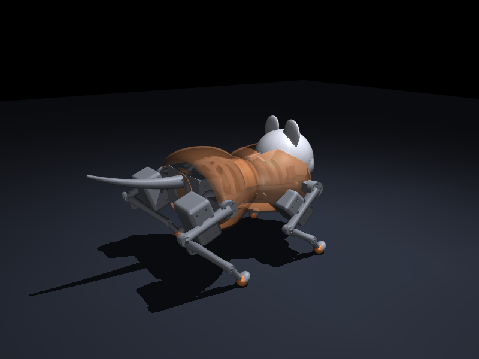

# Sabo — a low-cost, quiet, compliant 3D-printed quadruped



Sabo is a kitten-scale (**~1.5 kg**) quadruped platform: **fully 3D-printed**, driven by
cheap **serial-bus servos**, and designed to be **quiet** and **backdrivable** enough to
share close space with a live animal. It is built **design-as-code** — one parameter file
(`cad/params.py`) drives the CAD, the physics model, and the bill of materials, so the
*simulated* robot and the *printed* robot cannot drift apart.

It occupies a design point that is currently unserved: cheap-but-noisy hobby quadrupeds
(Pupper/Petoi class) are not backdrivable; quiet, backdrivable quadrupeds (QDD,
Mini-Cheetah/Solo class) are expensive and heavier. Sabo aims for **cheap + quiet +
backdrivable + sub-1 kg** at once.

> **Status — research platform, not yet built.** The mechanical design, physics
> validation, edge-AI hardware spec, and build plan are complete and *reproducible in
> simulation / CAD*. **No physical robot has been built yet.** All hardware-measured
> values (acoustic noise, backlash, backdrive torque, battery runtime, sim-to-real gap)
> are marked **TBD (hardware)** in the reports — they are the gating work, not claims.
> Component prices and servo calibration are first-guess estimates to be re-measured.

## Highlights

- **Cat-anatomical morphology** — digitigrade 4-DOF legs (front/rear differ), a sagittal
  spine (waist) joint, and a 2-axis head gimbal, in a parametric build123d model.
- **A limb architecture for cheap compliance** — a **proximal four-bar knee** (cable-free,
  light shank), a **remote-axle hip** (servos in the torso → −93 % hip lateral inertia),
  and **coupled underactuation** (2 motors/leg).
- **Design-as-code** — `python -m analysis.platform_report` regenerates the whole artifact
  set (CAD → MJCF → BOM → spec) from one parameter file, with no hand-authored URDF.
- **MuJoCo-validated motion** — stand / walk / trot gaits with IMU body-leveling, plus a
  cat-motion library (loaf, sit, pounce) — all stay upright with torque headroom.
- **Edge-AI + HAL brain** — a hardware-independent behavior stack (perception → mood →
  behavior → expression) behind a HAL, with a Jetson Orin Nano backend (stub-runnable on a
  dev box) and a serial-servo wiring pin-map.

## Repository layout

| Path | What |
|---|---|
| `cad/` | parametric CAD (build123d): `params.py` (source of truth), `servo.py`, `parts/`, `assembly.py`, `export.py`, `print_manifest.py`, `parts/split.py` |
| `sim/` | MuJoCo physics: `mjcf.py`, `gait.py`, `mj_emulate.py`, `cute_motion.py`, `meshes.py`, `fourbar_leg.py`, `brain_bridge.py` |
| `analysis/` | engineering checks + reporting: `validate.py`, `optimize.py`, `bom.py`, `fourbar.py`, `platform_spec.py`, `benchmark.py`, `platform_report.py`, `scaling_study.py` |
| `brain/` | hardware-independent behavior: HAL (`hal.py`), `perception.py`, mood/behaviors, expression, voice |
| `hardware/` | Jetson HAL backend (`jetson_backend.py`), serial servo bus map, `run_on_hardware.py` |
| `vision/` | camera geometry, pluggable detector, perception pipeline |
| `training/` | Isaac Lab RL locomotion scaffold, URDF export, policy deploy |
| `dashboard/` | Flask + SSE owner dashboard (Phase-0 behavior demo) |
| `docs/` | design docs — see the index below |
| `PLAN.md` | the original project plan |

Generated artifacts (`cad/out/`, `sim/out/`, `sim/meshes/`, `docs/out/`) are **git-ignored**;
they are regenerated by the toolchain (below).

## Quickstart

Requires **Python 3.14** (build123d + mujoco). `pybullet` is not used (it does not build on
3.14).

```bash
python -m venv .venv && . .venv/Scripts/activate   # Windows; use bin/activate on *nix
pip install -r requirements.txt

# engineering validation (mass / center-of-mass / joint torque vs servo stall)
python -m analysis.validate

# physics: gaits + cat-motion (headless renders written to sim/out/)
python -m sim.mj_emulate --gait walk
python -m sim.mj_emulate --gesture loaf      # also: sit, --pounce, --cute
python -m sim.mj_emulate --gait trot --view  # interactive 3-D viewer (if a display is present)

# CAD: printable STL/STEP + a mass manifest + renders (cad/out/)
python -m cad.export

# tests
python -m pytest -q
```

Windows consoles: prefix with `PYTHONIOENCODING=utf-8` if you hit a cp1252 encode error.

## Reproduce the platform characterization (design-as-code)

```bash
python -m analysis.platform_report     # cad.export → validate → meshes → spec → benchmark
python -m analysis.platform_spec       # spec sheet, derived live from the source of truth
python -m analysis.benchmark           # sim metrics + baseline scaffold + hardware-TBD slots
python -m analysis.scaling_study       # regenerate + re-validate the robot at k = 0.5–1.75
```

The **scaling study** shows the toolchain rescaling the whole robot from one `SCALE` knob
(env `SABO_SCALE`) with no drift, and finds the **viable build range k ≈ 0.7–1.25** — the
scale window is pinned by the *fixed* actuator/electronics, not the printed geometry.

## Documentation

- [`docs/platform.md`](docs/platform.md) — the platform contribution + evaluation protocol.
- [`docs/paper_outline_iros.md`](docs/paper_outline_iros.md) — technical paper outline.
- [`docs/build_mvp.md`](docs/build_mvp.md) — physical-build minimum spec (order → build → measure).
- [`docs/wiring_pinmap.md`](docs/wiring_pinmap.md) — full wiring / pin-map.
- [`docs/edge_ai_hardware.md`](docs/edge_ai_hardware.md) — compute / sensors / power.
- [`docs/assembly.md`](docs/assembly.md) — print + bolt-up guide.
- Design notes: [`docs/noise_reduction.md`](docs/noise_reduction.md),
  [`docs/tendon_actuation.md`](docs/tendon_actuation.md),
  [`docs/custom_actuator.md`](docs/custom_actuator.md),
  [`docs/camera_stabilization.md`](docs/camera_stabilization.md),
  [`docs/BOM.md`](docs/BOM.md).

## Status & roadmap

- **Done:** parametric CAD, MuJoCo validation, four-bar knee + remote-axle hip, cat-motion
  library, edge-AI hardware spec, wiring map, print-readiness + part-splitting, design-as-code
  characterization + scaling study.
- **Next (gating):** the **physical build** — order parts (`docs/build_mvp.md`), print,
  assemble, and take the five hardware measurements that carry the "quiet" and "compliant"
  claims.

## Motivation

Sabo began as a companion robot to befriend the maker's cat — hence kitten scale, quiet
operation, and compliant, animal-safe motion. That use case drives the requirements; the
repository itself is a general low-cost quadruped platform.

## License & attribution

Licensed under the **Apache License 2.0** — see [`LICENSE`](LICENSE).

Third-party assets retain their own licenses (see [`NOTICE`](NOTICE)), including the OpenCV
frontal-cat-face Haar cascade in `vision/models/`. Built with
[build123d](https://github.com/gumyr/build123d), [MuJoCo](https://mujoco.org/), and
[trimesh](https://github.com/mikedh/trimesh).

> This is experimental, unbuilt hardware provided "as is" with no warranty. Building and
> operating it (LiPo batteries, actuators, mains-powered tools) is at your own risk.
