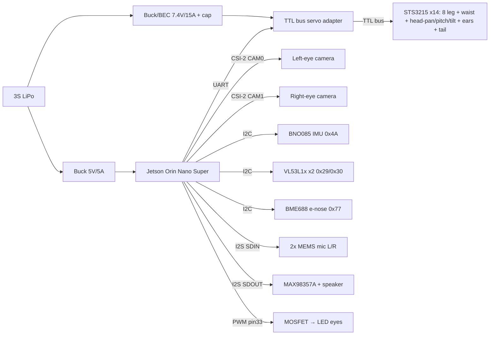

# Sabo — Edge-AI Hardware Design

Sabo is a **real-world, multi-sensor AI robot**: it fuses camera + IMU + distance
+ audio into a live world model, decides with the mood/behavior brain, and drives
14 servos — all **on-device**, no cloud. This document specifies the compute, the
sensor suite, the power system, and how it all maps onto the existing layered
software (`brain/hal.py`).

## 1. Compute — NVIDIA Jetson Orin Nano Super (8 GB)

| Why it wins for this robot | |
|---|---|
| **Same CUDA stack as the RTX 4090** | Train in PyTorch on the 4090 → export ONNX → `trtexec` builds a TensorRT engine on the Jetson. No cross-compile, no vendor model-conversion quirks (unlike Hailo/Coral). |
| **~67 TOPS (INT8), 8 GB** | Real-time detection + pose + sensor fusion, with headroom for a small on-device policy/RL net later. |
| **Sensor & robotics I/O** | 2× MIPI-CSI, 4× USB 3.2, GbE, 40-pin header (I²C/SPI/UART/PWM), M.2 (NVMe + Wi-Fi). |
| **Ecosystem** | JetPack 6 (Ubuntu 22.04), TensorRT, DeepStream, **Isaac ROS**, ROS 2 — the richest edge stack for world-sensor models, and it lines up with the Isaac Sim path noted for gait RL. |

**Cost of the choice:** power (7–25 W configurable) and weight/thermals. Mitigate
with a **compact carrier** (Seeed reComputer J401 / Antmicro) instead of the full
dev-kit carrier, a low-profile heatsink + small fan, and a bigger battery. Run at
the **15 W power mode** as the default balance.

## 2. Sensor suite (the "world" inputs)

| Sensor | Part | Bus | Feeds (`brain/hal.Senses`) |
|---|---|---|---|
| **Eyes (camera)** | 2× wide-FOV MIPI-CSI (IMX219, ~120°) — one per eye socket | CSI-2 ×2 | `camera()` → cat detection (bbox, class, motion); stereo → depth |
| **IMU** | **BNO085** (on-chip sensor fusion) | I²C | `imu()` → orientation for balance **and** camera EIS |
| **Distance** | 2× **VL53L1X** ToF (nose = forward, chin = down-angled) | I²C | `proximity()` → obstacle + **cliff/edge** detection |
| **Ears (mics)** | 2× **MEMS mic** (I²S/PDM), one per ear | I²S | `hearing()` → sound level + bearing + meow flag |
| **Nose (e-nose)** | **BME688** gas/VOC sensor | I²C | `smell()` → coarse scent (`cat`/`food`/`litter`/`unknown`) + intensity |

### Stereo eyes vs. mono + ToF — recommendation

**Go stereo: one wide-FOV camera per eye socket on the two MIPI-CSI lanes.** It is
anatomically honest (a camera behind each eye), the Jetson already exposes 2× CSI,
and a rectified pair gives a real *metric depth* on the cat that block-disparity or
a small stereo net can refine — the mono bbox-height range is coarse and breaks when
the cat is partly occluded or an unusual size. The forward **VL53L1X ToF stays** as
a cheap, fast, cat-agnostic backstop for close obstacles, and the down-angled ToF
still does cliff detection. So: **stereo for the cat, ToF for the floor and last-ditch
obstacle range.** The software cost is low — `camera()` still returns one
`CatDetection`; the right eye only *refines* `distance`. If board space or the second
CSI lane is needed elsewhere, degrade gracefully to **mono + forward ToF** (the code
already runs mono when the right eye is absent).

## 2a. Anatomical sensor placement (where each sense lives)

Sabo's senses map onto cat anatomy. Each row is **body part → part → bus → Jetson
40-pin/CSI pin** (pins are the Orin Nano header defaults; I²C bus 7 = pins 3/5).

| Body part | Sensor | Part | Bus | Jetson connection |
|---|---|---|---|---|
| **Left eye** | camera | IMX219 wide-FOV | CSI-2 | **CAM0** connector (15-pin FFC) |
| **Right eye** | camera | IMX219 wide-FOV | CSI-2 | **CAM1** connector (15-pin FFC) |
| **Inner ear** | IMU | BNO085 | I²C @0x4A | SDA pin 3 / SCL pin 5 |
| **Nose** | ToF (forward) | VL53L1X | I²C @0x29 | SDA 3 / SCL 5 (+ XSHUT on a GPIO) |
| **Chin** | ToF (down/cliff) | VL53L1X | I²C @0x30* | SDA 3 / SCL 5 (+ XSHUT on a GPIO) |
| **Left ear** | mic | MEMS I²S (L) | I²S | I2S_CLK pin 12, I2S_FS pin 35, **I2S_SDIN pin 38** |
| **Right ear** | mic | MEMS I²S (R) | I²S | shares CLK/FS; same **SDIN** line (L/R via WS), pin 38 |
| **Nose (scent)** | e-nose | BME688 | I²C @0x77 | SDA 3 / SCL 5 |
| **Mouth** | speaker | MAX98357A amp | I²S | I2S_CLK 12, I2S_FS 35, **I2S_SDOUT pin 40** |

\* The two VL53L1X ship at 0x29; hold one in reset via **XSHUT** at boot, re-address
the other to 0x30, then release — so both live on the one I²C bus (see §4).

The **mouth** is the existing `MAX98357A` I²S amp driving `Body.speak()` (meow /
trill / TTS) and the low-frequency purr rumble — output side of the same I²S bus the
ear mics read from (shared BCLK/LRCLK; mics on SDIN, amp on SDOUT).

## 3. Actuators & power

Actuator (FINALIZED 2026-07-10): **Feetech STS3215** serial bus servo — 30 kg·cm
(~2.9 N·m), metal gears, TTL half-duplex daisy-chain, position feedback,
torque/current control (backdrivable → compliant, **silent** hold; no digital
holding buzz). All 14 joints share **one TTL serial bus**; the PCA9685 PWM driver
is **dropped**. The LED eyes, which used to sit on a PCA9685 PWM channel, move to
a **Jetson hardware-PWM pin + MOSFET LED driver** (the STS3215 chain has no spare
PWM output).

```
3S LiPo ─┬─ buck 5V/5A ───────────────── Jetson Orin Nano (7–25 W)
         ├─ buck/BEC 7.4V/≥15A ─┬─ TTL bus adapter ── STS3215 ×14 (daisy-chain)
         │                      └─ bulk capacitor (servo current spikes)
         ├─ Jetson PWM pin 33 ── MOSFET ── LED eyes
         └─ 3.3V ─ sensors (IMU, ToF, mic, e-nose)  [Jetson rails or a small LDO]
```

- **Servo bus:** all 14 STS3215 daisy-chain on one TTL serial line via a **bus
  servo adapter** (Waveshare Bus Servo Adapter / FE-URT-1 on USB, or a buffered
  40-pin UART). Each servo has a unique **bus ID 1..14** (`servo_channel_map.py`).
- **Servo voltage:** the STS3215 runs **6–7.4 V** (abs-max ~8.4 V), so it can
  **not** take 3S (11.1 V) directly — a **buck/BEC drops 3S → 7.4 V** for the
  bus rail. Separate rail + big electrolytic cap so servo inrush never browns out
  the Jetson (the reset-risk in PLAN §10). Confirmed: 7.4 V is the recommended
  STS3215 operating point.
- **Current budget (7.4 V bus):** STS3215 stall is ~2.5–2.7 A each, but 14×stall
  (~37 A) never happens — legs load a few at a time and the head/ears/tail idle.
  Holding (torque on, no load) ≈ 0.1 A/servo → ~1.4 A (~10 W). Active gait:
  ~4–6 leg servos working at ~0.5–1 A + the rest idle → **~6–10 A peak, ~3 A
  avg**. Size the **buck/BEC for ≥15 A continuous** (~110 W) with a bulk cap to
  swallow transient inrush; 18 AWG for the servo-power trunk.
- **Power budget (15 W mode):** Jetson ~12 W avg, servos ~10–25 W avg (brief
  higher peaks), sensors ~1 W → ~25–35 W typical. A **3S 5000 mAh (55 Wh)** pack
  → ~1.5–2 h of active play; more when mostly watching/idle.
- **Battery:** 3S LiPo in a sealed, chew-proof belly compartment (`torso_aft`).

## 4. Wiring / bus map



The 14 STS3215 servos ride **one half-duplex TTL serial bus** off the adapter
(bus IDs 1..14, 1 Mbps), fed by the 7.4 V rail; the adapter connects to the
Jetson over **UART** (USB adapter or buffered 40-pin UART). The digital sensors
share **one I²C bus**: BNO085 `0x4A`, VL53L1X `0x29`→re-addressed `0x30` (distinct
addresses via **XSHUT** at boot), BME688 `0x77` — **no PCA9685 on the bus
anymore**. The two eye cameras take **CAM0/CAM1** (CSI-2); the two ear mics and
the mouth speaker share one **I²S** bus (BCLK + LRCLK common; mics on SDIN, amp on
SDOUT) — left/right mic separated by the WS/LRCLK phase. The **LED eyes** hang off
Jetson **hardware-PWM pin 33** through a MOSFET/LED driver.

## 5. Software stack & the train→deploy loop

1. **Train on the RTX 4090** (PyTorch): fine-tune a small detector (YOLOv8-n /
   SSD-MobileNet) on cat images — Sami's photos in `sami_photos/` are a natural
   fine-tune/eval set.
2. **Export ONNX → TensorRT** engine on the Jetson (`trtexec`, INT8/FP16).
3. **Runtime on Jetson:** JetPack 6 + TensorRT runs the detector at ~30 fps;
   IMU-based **EIS** (see `camera_stabilization.md`) de-shakes frames; the
   **Phase-0 brain** (`brain/`) runs on the Jetson CPU.
4. **HAL hardware backend** (new, Phase-2): implements `brain/hal.py` —
   `HardwareSenses` (camera→`CatDetection`, BNO085→`ImuReading`, VL53L1X→
   `ProximityReading`, mics→`HearingReading`, BME688→`SmellReading`) and
   `HardwareBody` (Expression verbs → STS3215 serial-bus positions). The **exact same**
   perception → mood → behavior code from Phase 0/1 then runs on the real robot.

## 5a. On-device AI pipelines

Three perception models run on the Jetson, all feeding `perception.WorldModel`.
All are **stub-safe** in `hardware/jetson_backend.py`: missing hardware/model →
neutral read.

**Vision — cat detector (done).** Fine-tune YOLOv8-n on `sami_photos/` on the 4090
→ ONNX → TensorRT engine at `vision/models/cat_yolov8n.engine`. `VisionPipeline`
runs it on the **left-eye** CSI frame (IMU-based EIS de-shakes first), picks the
best box, and returns bearing/distance/approach. The **right eye** adds stereo
disparity to refine `distance`. → `camera() → CatDetection`.

**Audio — localization + meow detection (`hearing()`).** The two ear mics give a
stereo block each tick:
- **Level** = block RMS (0..1 loudness).
- **Bearing** = **GCC-PHAT** cross-correlation of L vs R → time-difference-of-
  arrival; the lag → angle via the ear spacing (`d·sinθ/c`), clamped to ±90°.
  (Interaural *time* difference; level difference is the fallback.)
- **Meow** = a small audio classifier (fine-tuned YAMNet/PANNs head → ONNX at
  `vision/models/meow_audio.onnx`) run on the block → cat-vocalisation flag.
→ `hearing() → HearingReading(level, bearing, meow, present)`; perception maps
these to `sound_present/sound_bearing/sound_level/heard_meow`.

**Smell — scent classification (`smell()`).** The BME688 sweeps a heater profile;
its gas-resistance signature is the feature. A small trained head (ONNX at
`vision/models/scent.onnx`, or Bosch **BSEC**) classifies it to
`cat`/`food`/`litter`/`unknown`; a gas-resistance heuristic sets `intensity` and
gates presence. → `smell() → SmellReading(scent, intensity, present)`; perception
maps these to `scent/scent_intensity`.

## 6. Sensor-fusion → world model

```
eyes  ─(TensorRT detector + EIS + stereo)─┐
IMU   ─(orientation, tilt)────────────────┤
ToF   ─(distance, edge)───────────────────┼─▶ perception.WorldModel ─▶ mood ─▶ behavior
ears  ─(GCC-PHAT bearing + meow net)──────┤        (brain/, unchanged)
nose  ─(BME688 → scent classifier)────────┘
```

This is exactly the interface `brain/perception.py` already consumes — the sim
fills it from ground truth today; the Jetson fills it from real sensors later.

## 6a. AI actuator-control loop (all actuation is AI-driven)

Nothing moves a servo except an AI decision, and everything goes **through the
HAL** (`brain/hal.py` → `hardware/jetson_backend.HardwareBody`):

```
      ┌────────────── Jetson AI perception ───────────────┐
eyes ─▶ vision detector ─┐
ears ─▶ audio localizer ─┼─▶ perception.WorldModel ─┐
nose ─▶ scent classifier ┘                          │
IMU/ToF ─────────────────────────────────────────────┤
                                                     ▼
                                      brain: mood machine ─▶ behavior AI
                                                     │
                        ┌────────────────────────────┴───────────────┐
                        ▼ (expressive + head verbs)                    ▼ (gait intent)
             HardwareBody.look_at/set_ears/set_tail/…      HardwareBody.gait(mode,fwd,yaw)
                        │                                              │
                        │                            training.deploy_policy.LearnedGait
                        │                            (RL policy, ONNX) obs → joint targets
                        ▼                                              ▼
                   STS3215 bus servos ◀────────────────── STS3215 leg/waist servos
```

Two AI systems drive the actuators, both via `HardwareBody`:
1. **Behavior AI** — `perception → mood → behavior → Expression` picks
   head/eyes/ears/tail poses and issues the **locomotion intent** (`gait(mode,
   forward, yaw)`).
2. **Learned RL locomotion policy** — `LearnedGait` (trained in Isaac Lab,
   deployed as ONNX) turns that intent + IMU state into per-leg joint targets
   each tick, written straight to the STS3215 serial bus.

`hardware/run_on_hardware.py` wires this end-to-end: `--policy PATH.onnx` runs the
learned gait as the locomotion engine (no path → a safe standing-pose stub). So
the full loop is **sensors → Jetson AI → WorldModel → brain + RL policy →
STS3215 servos**, with the HAL as the only seam.

## 7. Edge-AI BOM (compute + sensing + power)

| Item | Part | Qty |
|---|---|---|
| Compute | Jetson Orin Nano Super 8 GB module | 1 |
| Carrier | Seeed reComputer J401 (compact) | 1 |
| Storage | NVMe M.2 SSD 128 GB + Wi-Fi/BT M.2 | 1 |
| Cooling | Low-profile heatsink + 30 mm fan | 1 |
| Eyes (camera) | Wide-FOV MIPI-CSI (IMX219, ~120°) — one per eye socket (stereo) | 2 |
| IMU | BNO085 | 1 |
| ToF | VL53L1X (nose forward + chin down/cliff) | 2 |
| Ears (mics) | I²S MEMS microphone (e.g. ICS-43434 / SPH0645), one per ear | 2 |
| Nose (e-nose) | BME688 gas/VOC sensor | 1 |
| Mouth (audio out) | MAX98357A I²S amp + speaker | 1 |
| Servo bus adapter | TTL bus servo adapter (Waveshare / FE-URT-1) | 1 |
| Servos | Feetech STS3215 serial bus (per `cad/servo.py`) | 14 |
| LED-eye driver | MOSFET + eye LEDs on Jetson PWM pin 33 | 1 |
| Power | 3S 5000 mAh LiPo + 5 V/5 A & 7.4 V/≥15 A bucks + bulk cap + XT60/BMS | 1 set |

> Later (PLAN §5 Phase-5): fold the bus adapter + bucks + IMU + ToF + LED driver +
> connectors onto a **custom carrier PCB** that seats the Jetson — the KiCad task.
> `kicad-cli` is available for ERC/DRC/gerbers when we get there.

## 8. Mechanical implications for the shell

The shell (next step) must house, matched to the anatomy in §2a:
- the Jetson+carrier (~70×45 mm board + heatsink, front torso for cooling airflow)
  and a **fan vent**;
- the 3S LiPo (belly of `torso_aft`);
- **two eye cameras**, one behind each eye socket, set at the `EYE_BASELINE_M`
  (~60 mm) inter-ocular spacing the stereo depth assumes — coordinate this baseline
  with sabo-mechanical;
- **two ToF ports**: nose (forward) + chin (down-angled cliff);
- **two ear-mic grilles**, one per ear, spaced ~`EAR_SPACING_M` (~90 mm) apart so
  the interaural bearing estimate has usable delay — keep them acoustically
  separated from the fan;
- a **nose vent** so ambient air reaches the BME688 e-nose (away from the fan
  exhaust, which would wash out scent);
- a **mouth speaker grille** for the MAX98357A.

These drive the cat-shell interior volumes and the two mounting baselines
(`EYE_BASELINE_M`, `EAR_SPACING_M`) the AI pipelines depend on.
