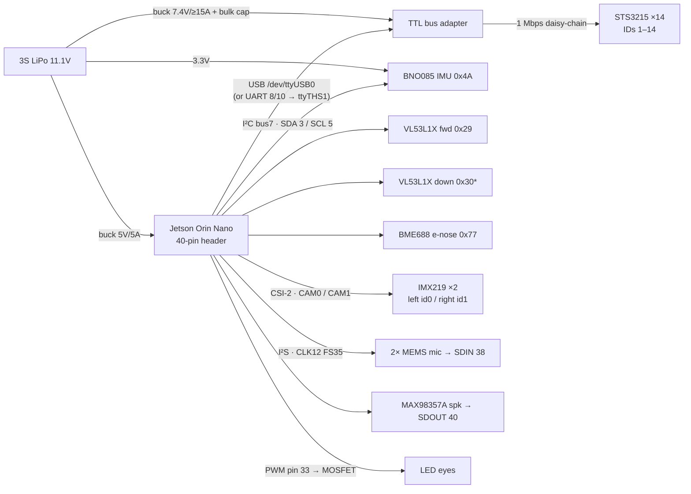

# Sabo — Wiring Pin-Map

Every connection needed to build the robot: **14 STS3215 servos** on one TTL serial
daisy-chain, an I²C sensor bus, stereo CSI eyes, a shared I²S audio bus, and a
three-rail power tree — all off the **Jetson Orin Nano Super (8 GB)** 40-pin header.

> Source of truth: [`hardware/servo_channel_map.py`](../hardware/servo_channel_map.py),
> [`hardware/jetson_backend.py`](../hardware/jetson_backend.py),
> [`docs/edge_ai_hardware.md`](edge_ai_hardware.md). A visual version of this map is
> also published as a Claude artifact. **All values are first-guess — re-measure per
> physical servo/sensor at bring-up.**

## Bus map

`*` Both VL53L1X ship at `0x29`; hold one in **XSHUT** reset at boot, re-address the
other to `0x30`, then release. BME688 = `0x76` if SDO tied low.

## Servo daisy-chain — one TTL line, IDs 1–14

Chain order keeps the trunk short: front legs → rear legs → spine/head → appendages.
Right-side legs `invert` (mirror horns). STS3215 = 12-bit, center 2048, ≈651.9 counts/rad.

| ID | Actuator | Group | Limit (rad) | Limit (°) | Horn |
|---:|----------|-------|-------------|-----------|------|
| 1  | FL_hip     | front-left leg  | −2.6 … 2.6  | ±149   | — |
| 2  | FL_knee    | front-left leg  | 0 … 2.62    | 0…150  | — |
| 3  | FR_hip     | front-right leg | −2.6 … 2.6  | ±149   | invert |
| 4  | FR_knee    | front-right leg | 0 … 2.62    | 0…150  | invert |
| 5  | RL_hip     | rear-left leg   | −2.6 … 2.6  | ±149   | — |
| 6  | RL_knee    | rear-left leg   | 0 … 2.79    | 0…160  | — |
| 7  | RR_hip     | rear-right leg  | −2.6 … 2.6  | ±149   | invert |
| 8  | RR_knee    | rear-right leg  | 0 … 2.79    | 0…160  | invert |
| 9  | waist      | spine           | −0.45 … 0.65| −26…37 | — |
| 10 | head_pan   | gimbal yaw      | −1.4 … 1.4  | ±80    | — |
| 11 | head_pitch | gimbal nod      | −0.7 … 0.7  | ±40    | — |
| 12 | head_tilt  | gimbal roll     | −0.7 … 0.7  | ±40    | — |
| 13 | ear_L      | ear (ear_R follows mechanically) | −0.6 … 0.6 | ±34 | — |
| 14 | tail       | tail            | −1.2 … 1.2  | ±69    | — |

**Four-bar knee:** the knee servo drives the crank; the linkage converts crank → knee
angle, so the ID 2/4/6/8 position command is the **crank-side** value — re-measure the
crank→knee ratio when calibrating each physical leg.

## Jetson 40-pin header — pins used

| Pin | Signal | Goes to |
|----:|--------|---------|
| 1   | 3.3 V     | sensor logic power |
| 3   | I²C SDA   | IMU · ToF ×2 · e-nose |
| 5   | I²C SCL   | IMU · ToF ×2 · e-nose |
| 8   | UART TXD  | servo bus (buffered-UART option) |
| 10  | UART RXD  | servo bus (buffered-UART option) |
| 12  | I²S BCLK  | mics + speaker (shared) |
| 33  | PWM       | LED-eye driver (pwmchip0 ch0) |
| 35  | I²S LRCLK | mics + speaker (shared) |
| 38  | I²S SDIN  | ear mics (L/R via WS) |
| 40  | I²S SDOUT | MAX98357A speaker |
| GPIO| XSHUT     | 2nd ToF reset (any spare) |
| GND | Ground    | pins 6/9/14/20/25/30/34/39 |

Servo bus default is **USB** (`/dev/ttyUSB0`, Waveshare Bus Servo Adapter / FE-URT-1);
the 40-pin UART (`ttyTHS1`, pins 8/10, buffered) is the alternative. Set via
`SABO_SERVO_PORT`.

## I²C devices & cameras

| I²C device | Addr | Anatomy |
|------------|------|---------|
| BNO085 IMU        | 0x4A | inner ear — balance + camera EIS |
| VL53L1X (forward) | 0x29 | nose — obstacle range |
| VL53L1X (down)    | 0x30 | chin — cliff detect |
| BME688 e-nose     | 0x77 | nose — scent classifier |

| Camera | Port | sensor-id |
|--------|------|:---------:|
| IMX219 left eye  | CAM0 (15-pin FFC) | 0 |
| IMX219 right eye | CAM1 (15-pin FFC) | 1 |

## Power tree

**3S LiPo · 11.1 V nominal (9.9–12.6 V)** →

| Rail | Feeds | Notes |
|------|-------|-------|
| buck **5 V / 5 A** | Jetson Orin Nano carrier | 7–25 W configurable; run the 15 W mode |
| buck/BEC **7.4 V / ≥15 A** + bulk cap | TTL bus adapter → STS3215 ×14 | hold ≈1.4 A, gait ≈3 A avg / 6–10 A peak; 18 AWG trunk |
| **3.3 V** (Jetson rail or LDO) | IMU · ToF ×2 · mics · e-nose | logic power |

STS3215 runs 6–7.4 V, so it **cannot** take 3S directly — the dedicated 7.4 V buck +
bulk capacitor absorb servo current spikes and keep the compute rail clean.
